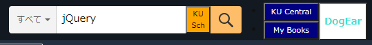
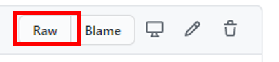

# KindleUnlimitedSearcher

Kindle Unlimited をもっと使いやすくするツールです。\
Kindle Unlimited 読み放題対象の本のみを検索したい想いから作りました。

Kindle Unlimited 関連はリンクや検索方法が分かりにくい or 使いにくいと感じるので、ワンタッチで便利に使えるツールを作りました。\
メモとハイライトのページは、知る人ぞ知る機能だと思うので、是非活用してください。

## 前提条件
* ブラウザのアドオンにて動作します。
  * Firefoxなら [Grease Monkey](https://addons.mozilla.org/ja/firefox/addon/greasemonkey/)
  * Chrome or Vivaldiなら [Tampermonkey](https://chrome.google.com/webstore/detail/tampermonkey/dhdgffkkebhmkfjojejmpbldmpobfkfo?hl=ja)
  * ※他のブラウザでの動作検証はしていません。

## 機能一覧
* Kindle Unlimited 読み放題対象の Kindle 本のみの検索ボタン
* Kindle Unlimited にてレンタル中の本一覧ページへ飛ぶボタン（Kindle Unlimited セントラル）
* 購入本も含めた Kindle 本一覧ページへ飛ぶボタン（コンテンツと端末の管理）
* Kindle 本内でメモやハイライトを付けた項目一覧ページへ飛ぶボタン（メモとハイライト）

## 導入方法
1. ブラウザのアドオンをインストールしてください。
  * Firefoxなら [Grease Monkey](https://addons.mozilla.org/ja/firefox/addon/greasemonkey/)
  * Chrome or Vivaldiなら [Tampermonkey](https://chrome.google.com/webstore/detail/tampermonkey/dhdgffkkebhmkfjojejmpbldmpobfkfo?hl=ja)
  * ※他のブラウザでの動作検証はしていません。
2. Github 上ののプログラムファイルページ [Kindle_Unlimited_Searcher.user.js](Kindle_Unlimited_Searcher.user.js) にて、上段右の 「Raw」と書かれたボタンを押下。\

3. アドオンのページで「インストール」をクリックすることで導入完了。

## 使い方
Amazonのページを認識して自動でボタンが生成されます。

### KU_Sch (Kindle Unlimited 検索ボタン)
検索ボックスに文字列を入力し、このボタンをクリックすると、Kindle Unlimited 読み放題対象の本が検索されます。

### KU Central (Kindle Unlimited セントラルへのリンク)
このボタンを押すと、Kindle Unlimited にてレンタル中の本一覧ページ（Kindle Unlimited セントラル）へ飛びます。

### My Books (コンテンツと端末の管理へのリンク)
このボタンを押すと、購入本も含めた Kindle 本一覧ページ（コンテンツと端末の管理）へ飛びます。

### DogEar (メモとハイライトへのリンク)
このボタンを押すと、Kindle 本内でメモやハイライトを付けた項目一覧ページ（メモとハイライト）へ飛びます。

## 無効化・削除方法
各種アドオンから無効化・削除を実施してください。
